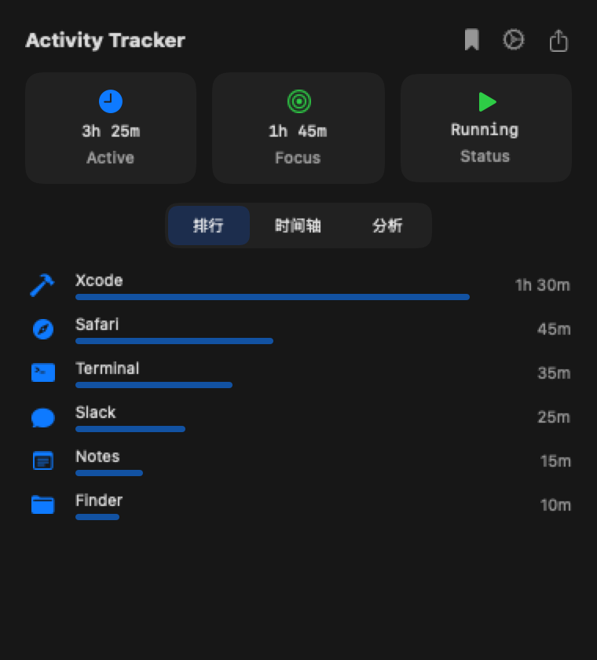
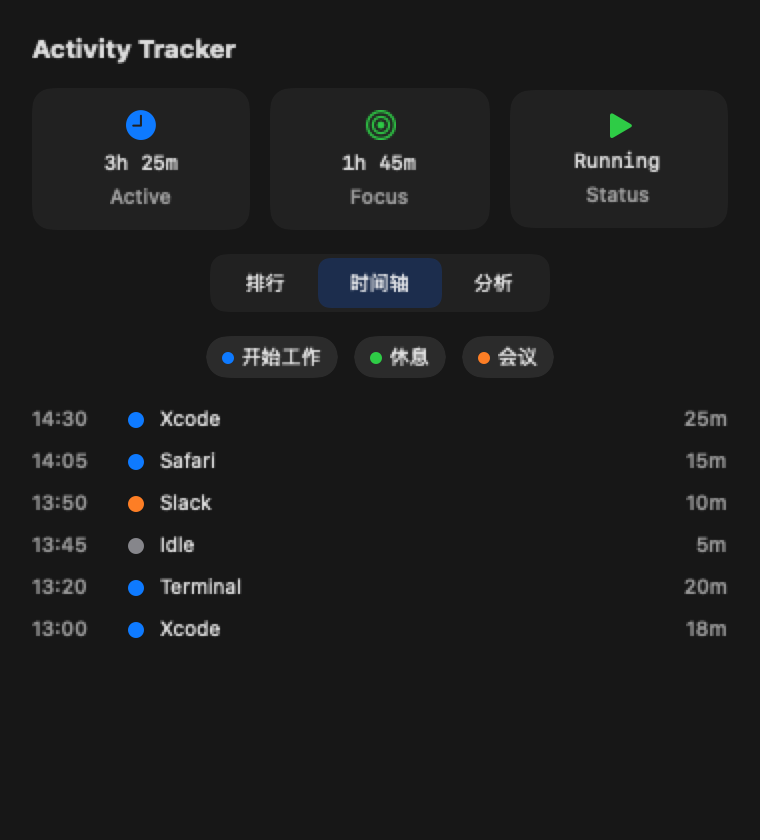
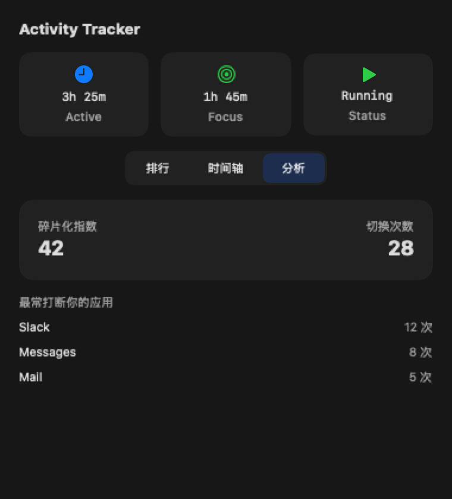
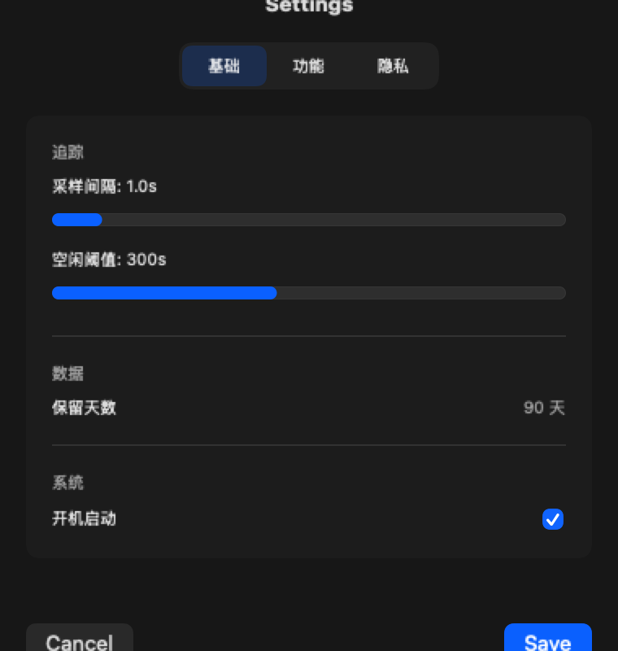
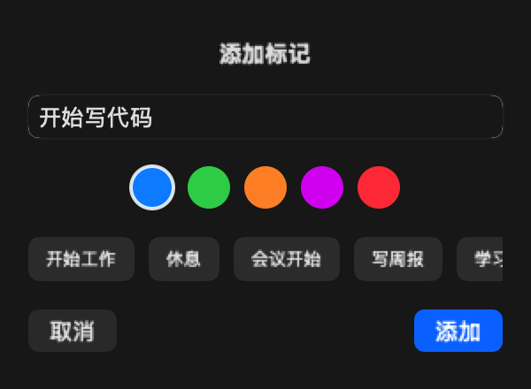

# Activity Tracker

一款 macOS 菜单栏应用，用于追踪和分析个人应用使用情况（元数据级）。

## 截图预览

### 主界面 - 应用排行榜


### 时间轴视图


### 切换分析


### 设置界面


### 添加标记


## 目录

- [功能特性](#功能特性)
- [项目结构](#项目结构)
- [系统要求](#系统要求)
- [安装与运行](#安装与运行)
- [使用指南](#使用指南)
- [权限说明](#权限说明)
- [数据存储](#数据存储)
- [隐私声明](#隐私声明)
- [技术架构](#技术架构)
- [License](#license)

---

## 功能特性

### 🎯 核心追踪

| 功能 | 说明 |
|------|------|
| 前台应用追踪 | 定时采样当前前台应用，记录使用时间 |
| 空闲检测 | 使用 IOKit 检测系统空闲状态 |
| 窗口标题获取 | 可选功能，需要 Accessibility 权限 |
| 使用分段 | 将连续使用同一应用的时间合并为 Segment |

### 🏷️ 行为分析

| 功能 | 说明 | 默认状态 |
|------|------|----------|
| 活动标签 | 自动分类为开发/写作/学习/会议/娱乐 | ✅ 开启 |
| 项目识别 | 根据窗口标题、路径自动归类到项目 | ✅ 开启 |
| 会议检测 | 自动识别 Zoom/Teams/Meet 等会议应用 | ✅ 开启 |
| 参与度评分 | 基于输入活动计算 Focus/Light/Passive | ❌ 关闭 |

### 📊 生产力功能

| 功能 | 说明 |
|------|------|
| 专注会话 | 手动或自动开始专注模式，记录专注时长 |
| 目标提醒 | 设定使用时长目标，超限时通知提醒 |
| 手动标记 | 在时间轴上添加书签（如"开始工作"） |
| 时间账单 | 按标签/项目导出工时统计 |

### 📈 可视化分析

| 功能 | 说明 |
|------|------|
| 应用排行榜 | 显示使用时长 Top 10 应用 |
| 时间轴 | 按时间顺序展示使用记录 |
| 碎片化指数 | 衡量应用切换频率 |
| 切换流分析 | 统计最常打断你的应用 |

### 🔒 数据治理

| 功能 | 说明 |
|------|------|
| 数据保留 | 自动清理过期数据（默认 90 天） |
| 数据脱敏 | 自动隐藏邮箱、Token 等敏感信息 |
| 应用过滤 | 黑名单/白名单模式 |
| 本地存储 | 所有数据仅保存在本地 |

---

## 项目结构

```
ActivityTracker/
├── ActivityTracker.xcodeproj/     # Xcode 项目文件
└── ActivityTracker/
    ├── App/                       # 应用入口
    │   ├── ActivityTrackerApp.swift   # @main 入口，菜单栏配置
    │   └── ContentView.swift          # 主内容视图
    │
    ├── Core/                      # 核心模块
    │   ├── AppTracker.swift           # 应用追踪器（核心）
    │   ├── IdleDetector.swift         # 空闲检测（IOKit）
    │   ├── DataStore.swift            # 数据存储管理
    │   ├── StatisticsManager.swift    # 统计计算
    │   └── ExportManager.swift        # 数据导出
    │
    ├── Models/                    # 数据模型
    │   ├── AppSegment.swift           # 应用使用分段
    │   ├── DailySummary.swift         # 每日汇总
    │   ├── ProjectAndLabel.swift      # 项目和标签定义
    │   ├── ActivityModels.swift       # 活动相关模型
    │   ├── AppStatistics.swift        # 应用统计
    │   ├── TrackerSettings.swift      # 设置模型
    │   └── HeatmapData.swift          # 热力图数据
    │
    ├── Features/                  # 功能模块
    │   ├── ActivityLabeler.swift      # 活动标签分类
    │   ├── ProjectDetector.swift      # 项目检测
    │   ├── MeetingDetector.swift      # 会议检测
    │   ├── EngagementTracker.swift    # 参与度追踪
    │   ├── GoalManager.swift          # 目标管理
    │   ├── FocusSessionManager.swift  # 专注会话
    │   ├── BookmarkManager.swift      # 书签管理
    │   ├── DataRedactor.swift         # 数据脱敏
    │   └── SwitchAnalyzer.swift       # 切换分析
    │
    ├── Views/                     # 视图层
    │   ├── DashboardView.swift        # 主仪表盘
    │   ├── SettingsView.swift         # 设置界面
    │   └── Components/                # UI 组件
    │       ├── StatCard.swift             # 统计卡片
    │       ├── AppRankRow.swift           # 排行榜行
    │       ├── TimelineRow.swift          # 时间轴行
    │       └── BookmarkComponents.swift   # 书签组件
    │
    ├── Utils/                     # 工具类
    │   └── Helpers.swift              # 辅助函数
    │
    ├── Assets.xcassets/           # 资源文件
    ├── Info.plist                 # 应用配置
    └── ActivityTracker.entitlements   # 权限配置
```

---

## 系统要求

- macOS 13.0 (Ventura) 或更高版本
- Xcode 15.0 或更高版本
- Swift 5.9+

---

## 安装与运行

### 从源码编译

1. 克隆仓库
```bash
git clone <repository-url>
cd ActivityTracker
```

2. 打开 Xcode 项目
```bash
open ActivityTracker.xcodeproj
```

3. 选择目标设备为 "My Mac"

4. 按 `Cmd + R` 编译运行

### 首次运行

应用启动后会自动开始追踪，菜单栏会出现波形图标 (waveform.path.ecg)。

---

## 使用指南

### 基本操作

| 操作 | 说明 |
|------|------|
| 点击菜单栏图标 | 打开主面板 |
| 点击 Status 卡片 | 暂停/恢复追踪 |
| 点击 Focus 卡片 | 开始/结束专注会话 |
| 点击书签图标 | 添加手动标记 |
| 点击齿轮图标 | 打开设置 |
| 点击导出图标 | 导出数据 |

### 标签页

- **排行**: 显示应用使用时长排行榜
- **时间轴**: 按时间顺序显示使用记录
- **分析**: 显示碎片化指数和切换分析

### 设置选项

#### 基础设置
- **采样间隔**: 0.5-5 秒，控制追踪精度
- **空闲阈值**: 60-600 秒，判定空闲的时间
- **数据保留**: 7-180 天

#### 功能开关
- 项目识别、活动标签、会议检测
- 专注会话、目标提醒
- 窗口标题、输入统计、参与度评分

#### 隐私设置
- 数据脱敏开关
- 应用黑名单配置

---

## 权限说明

| 权限 | 用途 | 必需 |
|------|------|------|
| 无 | 基础追踪功能 | ✅ |
| Accessibility | 窗口标题、输入统计 | ❌ |
| 通知 | 目标提醒 | ❌ |

### 申请 Accessibility 权限

如果启用窗口标题或输入统计功能，系统会提示授权：

1. 打开 **系统设置** > **隐私与安全性** > **辅助功能**
2. 点击 **+** 添加 Activity Tracker
3. 重启应用

---

## 数据存储

### 存储位置

```
~/Library/Application Support/ActivityTracker/
├── segments_2024-01-15.json    # 每日数据
├── segments_2024-01-16.json
├── settings.json               # 设置
├── labels.json                 # 自定义标签
├── projects.json               # 项目配置
├── goals.json                  # 目标配置
└── export_*.csv                # 导出文件
```

### 数据格式

每日数据 (JSON):
```json
{
  "date": "2024-01-15",
  "segments": [
    {
      "id": "uuid",
      "startTime": "2024-01-15T09:00:00Z",
      "endTime": "2024-01-15T09:30:00Z",
      "bundleId": "com.apple.dt.Xcode",
      "appName": "Xcode",
      "labelId": "dev",
      "isIdle": false
    }
  ],
  "totalActiveTime": 28800,
  "totalIdleTime": 3600
}
```

### 导出格式

- **CSV**: 完整分段数据，适合 Excel 分析
- **JSON**: 原始数据，适合程序处理
- **Timesheet**: 按标签/项目汇总的工时表

---

## 隐私声明

### 我们收集什么

✅ 收集:
- 前台应用的 Bundle ID 和名称
- 应用使用的开始/结束时间
- 窗口标题（仅在启用时）
- 输入活动统计（仅在启用时，不记录内容）

❌ 不收集:
- 键盘输入内容
- 聊天记录、密码
- 屏幕截图或录制
- 网页浏览内容

### 数据去向

- ✅ 所有数据仅保存在本地
- ❌ 不上传到任何服务器
- ❌ 不与第三方共享

### 用户控制

- 随时暂停/恢复追踪
- 清空历史数据
- 配置应用黑名单
- 启用数据脱敏

---

## 技术架构

### 核心技术栈

| 技术 | 用途 |
|------|------|
| Swift 5.9 | 主要开发语言 |
| SwiftUI | UI 框架 |
| AppKit | 系统集成 |
| IOKit | 空闲检测 |
| Accessibility API | 窗口标题获取 |
| UserNotifications | 目标提醒 |
| ServiceManagement | 开机启动 |

### 架构设计

```
┌─────────────────────────────────────────────────┐
│                    Views                         │
│  (DashboardView, SettingsView, Components)      │
└─────────────────────┬───────────────────────────┘
                      │
┌─────────────────────▼───────────────────────────┐
│                   Features                       │
│  (Labeler, Detector, Manager, Analyzer)         │
└─────────────────────┬───────────────────────────┘
                      │
┌─────────────────────▼───────────────────────────┐
│                    Core                          │
│  (AppTracker, DataStore, StatisticsManager)     │
└─────────────────────┬───────────────────────────┘
                      │
┌─────────────────────▼───────────────────────────┐
│                   Models                         │
│  (AppSegment, DailySummary, Settings)           │
└─────────────────────────────────────────────────┘
```

### 数据流

```
NSWorkspace.frontmostApplication
        │
        ▼
   AppTracker (采样)
        │
        ├──► ActivityLabeler (标签分类)
        ├──► ProjectDetector (项目识别)
        ├──► MeetingDetector (会议检测)
        │
        ▼
   DataStore (存储)
        │
        ▼
   StatisticsManager (统计)
        │
        ▼
   DashboardView (展示)
```

---

## License

MIT License

---

## 贡献

欢迎提交 Issue 和 Pull Request！

## 致谢

- SF Symbols - 图标
- SwiftUI - UI 框架
